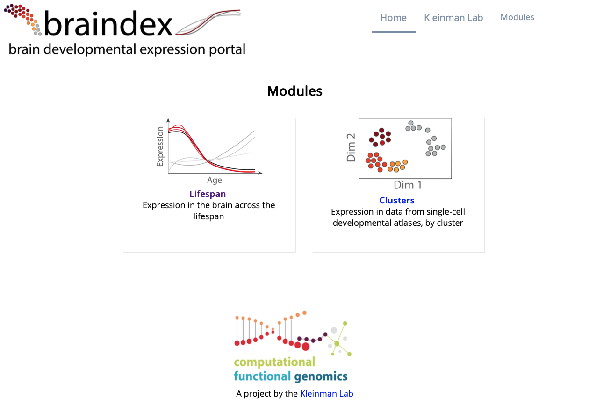

# braindex: brain developmental expression portal




## About

This repository hosts the code for a directory of shiny apps created to visualize and interrogate
brain developmental gene expression data. Each app is designed for a different type of data.


## Directory organization

In this directory, several resources pertain globally to the portal:

* `www`: Special directory to expose resources for the website, including the CSS
specification for the index page and individual apps, the portal and lab logos
* `www/layout`: Files containing the HTML for various page parts (e.g. header, footer)
inserted into each app for custom styling and navigation, using the helper functions
in `www/ui_functions.R`
* `index.html`: Contains the HTML for the homepage, which links to the apps hosted in the directory
* `style.R`: An R script which can be sourced by each app, containing styles shared
across apps. Currently contains a ggplot2 theme, `theme_min()`.


There is one directory for each app, containing at minimum two R files `server.R` and `ui.R`,
and a data directory `data`.

* `lifespan`: Containts the R code for the shiny app for exploring gene expression in the
brain across the lifespan, based on data from the BrainSpan project
* `clusters`: Contains the R code for the shiny app for exploring gene expression
based on clusters from the scRNAseq atlas of the developing mouse forebrain and pons
generated our lab


## Datasets which can be explored with the app

* Miller, J.A. et al. (2014) Transcriptional landscape of the prenatal human brain, Nature 508: 199-206. [doi:10.1038/nature13185](https://doi.org/10.1038/nature13185.) (Data is © 2010 Allen Institute for Brain Science. Allen Human Brain Atlas. Available from: https://www.brainspan.org/)

* Jessa, S. et al. (2019) Stalled developmental programs at the root of pediatric brain tumors, Nature Genetics 51: 1702-1713. [doi:10.1038/s41588-019-0531-7](https://doi.org/10.1038/s41588-019-0531-7)


## Data files used within the app

**NOTE**: No data is actually stored within the git repository.

Each app uses various forms of processed data for the different visualizations
and analyses. Typically this processing involves a lot of computation done beforehand,
in order to minimize computation within the app itself, and generally it is done on Hydra.
Occasionally, a smaller amount of processing is done which is highly specific to this app,
in which case the scripts are saved under `data/data_prep`.

In order to keep track of the provenance of each file, each `data` directory contains a file called `data.json`,
which is a human and machine readable description of all the files in each `data` directory,
following the struture within the directory itself.

If the `data` directory is organized
into sub-directories, the `data.json` file contains one object (wrapped in `{}`) per sub-directory, and
each object is an array (wrapped in `[]`) of "file objects", with the following required properties: 

* `file`, specifying the name of the file
* `description`, a plain-language description of what the file stores
* `contents`, a technical description of what the file contains, ideally specifying
the format (feather file, `.Rds`, `.Rda`, or TSV), the name of the object or columns, etc

Each file object must have one of the following properties:
* `path`, path from the lab's project folder on Hydra or Beluga
* `script`, path to the script which generated the file within this repoistory, from the `data` directory
of the respective app

Although the development of this app and addition of new data files is done in a 
piece by piece manner, the idea of documenting the data this way is that it would
be fairly easy to set up on a new machine, and make a script that reads in the `data.json`
files for each app, recreates the directory structure, copies over the data from Hydra, 
and runs any local data preparation scripts.

Example:


```json

     {
       
       "file": "joint_pons.gene_names.tsv",
       "path": "sjessa/from_hydra/single_cell/scDev_data/data/joint_pons/joint_pons.gene_names.tsv",
       "description": "Names of all genes detected in the joint pons dataset",
       "contents": "Data frame with one column, 'genes', containing gene symbols"
       
     },
     
     
```

### Reading `.json` file into R

Here's an example of how we can read `data.json` files into R (although
it could be done in another language), as the basis for creating a
script to re-populate the `data` directory for the `clusters` app. The object
returned by `fromJSON` is a list of 3 elements corresponding to folders,
each element is a data frame which describes the files in that folder.

```r

library(jsonlite)

data_doc <- fromJSON("clusters/data/data.json")

str(data_doc)
# List of 3

tibble::glimpse(data_doc$joint_mouse)
# Rows: 8
# Columns: 5
# $ file        <chr> "ID_20190715_dendrogram_order.Rda", "mean_expression_per_ID_20190715_cluster.feather", "pct1_per_ID_20190715_cluster.feather", "joi…
# $ path        <chr> "sjessa/from_hydra/single_cell/scDev_data/data/joint_mouse/ID_20190715_dendrogram_order.Rda", "sjessa/from_hydra/single_cell/scDev_…
# $ description <chr> "Cluster names in the short format ('F-e12 DRGC') in the order of the dendrogram in Fig 1 of Jessa et al, Nat Genet, 2019", "Feathe…
# $ contents    <chr> "R object containing a vector called 'dendrogram_order', where elements are cluster names", "Table with first column 'Cluster' and …
# $ script      <chr> NA, NA, NA, NA, NA, NA, "data_prep/prep_data.R", "data_prep/prep_data.R"

```

[Here is a script to do this for another app](https://github.com/fungenomics/brain_TF_app/blob/master/data/populate_data_on_hydra.R), also from a `data.json` file.

## Server configuration

For posterity, here is the part of the shiny-server configuration file at `/etc/shiny-server/shiny-server.conf`,
which specifies this directory of apps:

```

location /braindex {

    site_dir /srv/shiny-server/braindex;
    log_dir /var/log/shiny-server/braindex/;
    directory_index on;
    
  }
  
```


